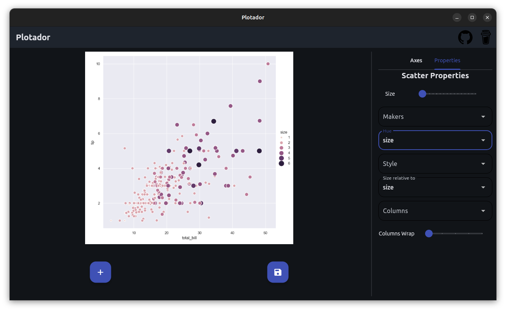
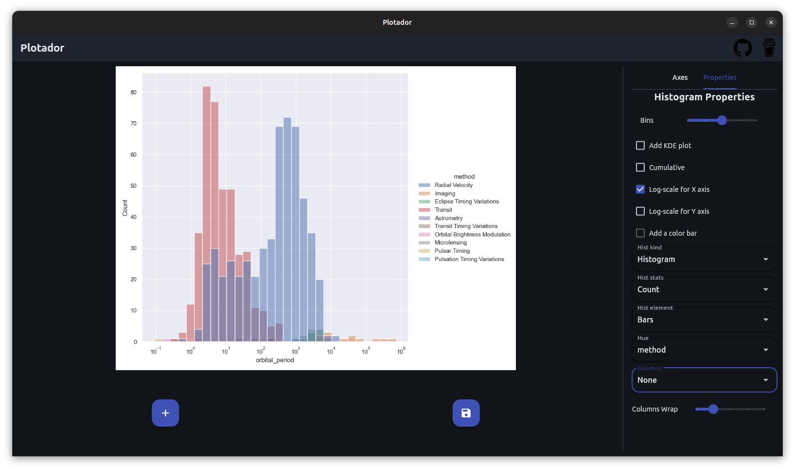
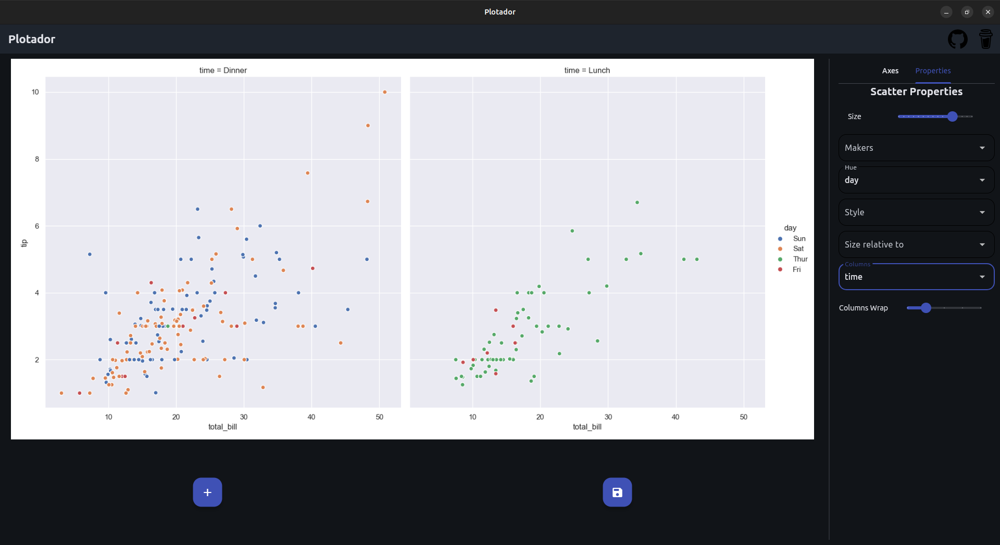
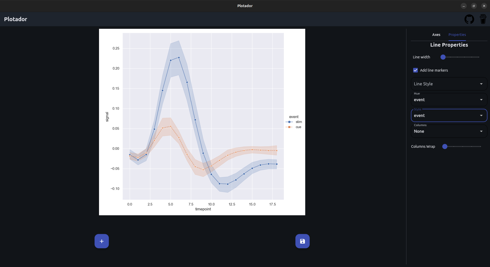
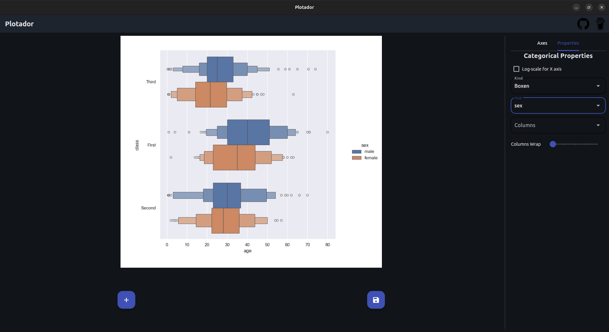

# Plotador

Plotador is a simple and easy-to-use plotting app built with [Flet](https://github.com/flet-dev/flet).  
It uses [Seaborn](https://github.com/mwaskom/seaborn) to create and customize your graphs, all through a clean and intuitive interface.

No login, no subscription — everything runs locally!

## How to use

https://www.youtube.com/watch?v=3xWLBHWQP-U

## Plot types

Currently three types of plots are suported:

- Distribution;
- Line;
- Scatter;
- Categorical.

Each with its own customizations.

### Distribution

Plot distributions on 1D and 2D. A color bar can be added to 2D distributions. You can choose between:

- Histograms;
- KDE;
- eCDF.

2D KDE plots may take a second to load.

### Scatter

Make a scatter plot. You can set markers shape and size.

### Line

A line plot of your data. If multiple Y values are found for the same X value, a confidence interval is show. You can set line width and style.

### Categorical

Categorical plot. The following types are accepted:

- Strip;
- Swarn;
- Box;
- Violin;
- Boxen;
- Point;
- Bar;
- Count.

## Files Formats

- Plotador accepts CSVs and Excel files formats.

## Features

In addition to specific customizations, all plot types share the following features:

- **Title**:  
  Sets the title of the figure. When a value is selected in the "Column" option, it sets the title for each subplot column accordingly.

- **Labels**:  
  Sets the axis labels. For 1D distributions, the Y-axis label cannot be changed.

- **Columns**:  
  All plots include the options "Column" and "Column wrap".  
  - The "Column" option creates subplots based on a categorical column in your data. It generates one subplot per category (up to 15). If there are more than 15 categories, a dialog will prompt you to choose a different column.  
  - The "Column wrap" property defines how many subplots appear per row.

- **Auto-reload**:  
  If you edit the data file, the application will detect the changes and automatically update your plot.