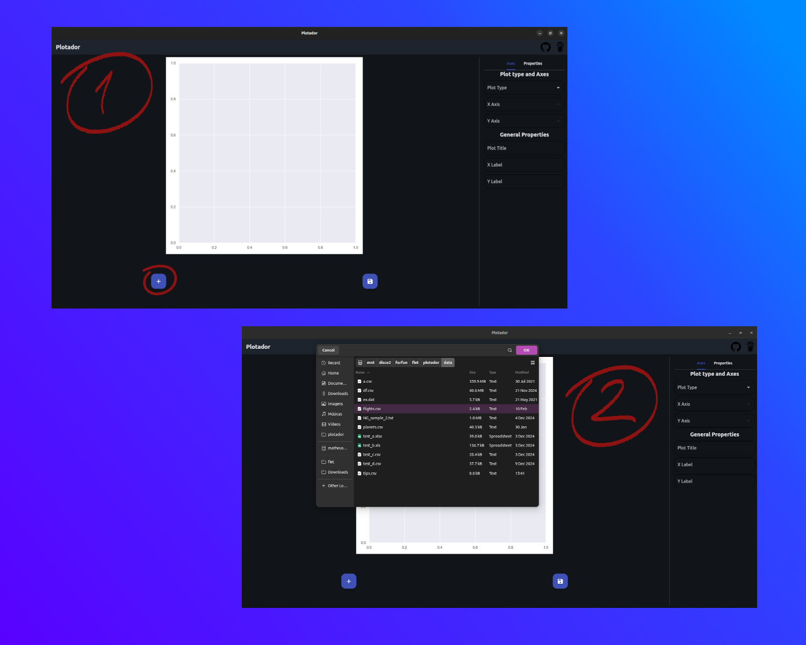
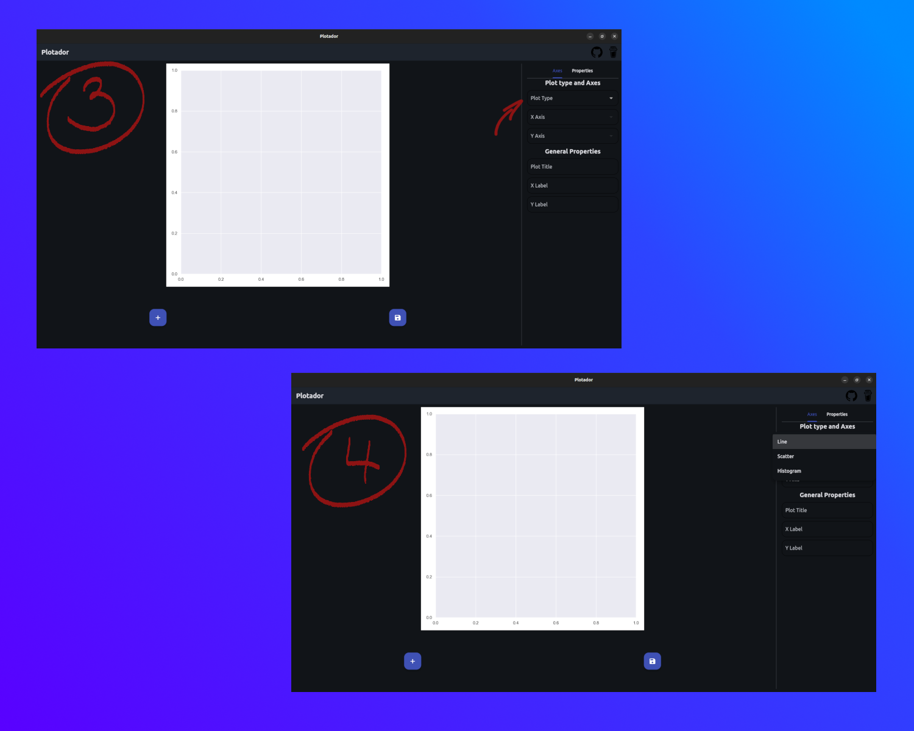
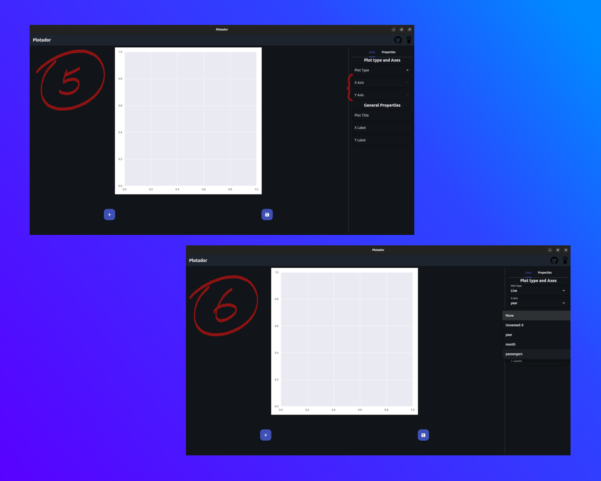
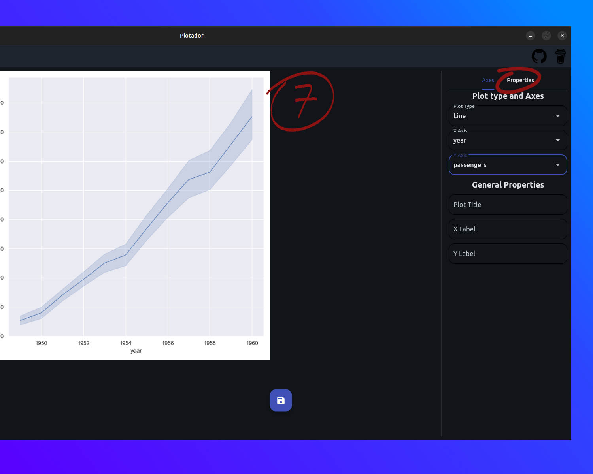
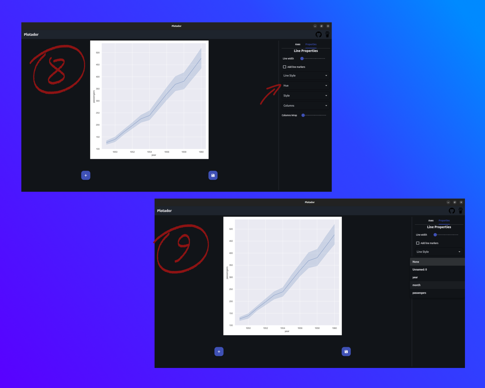
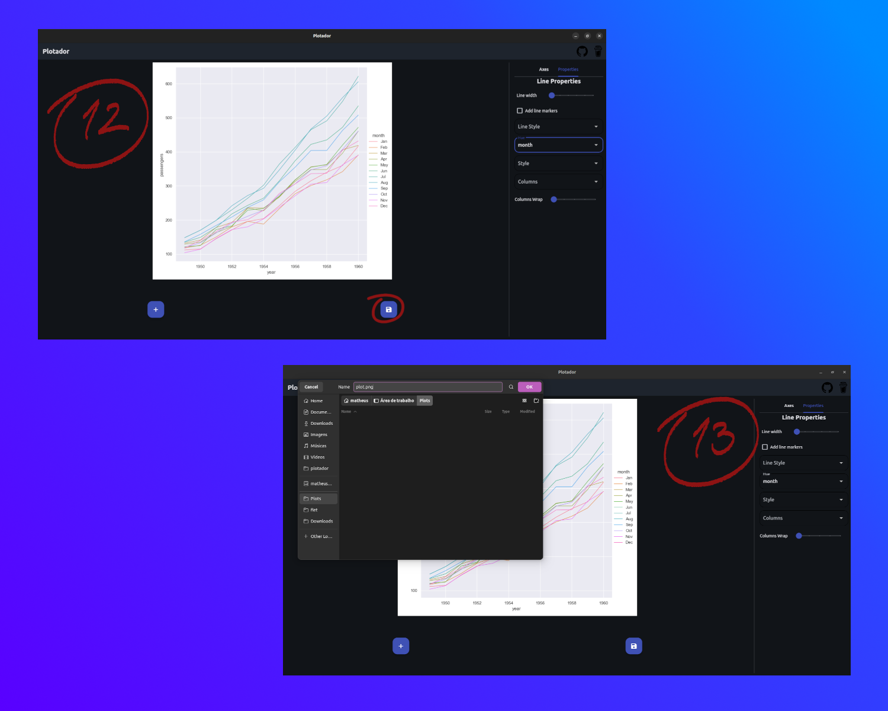
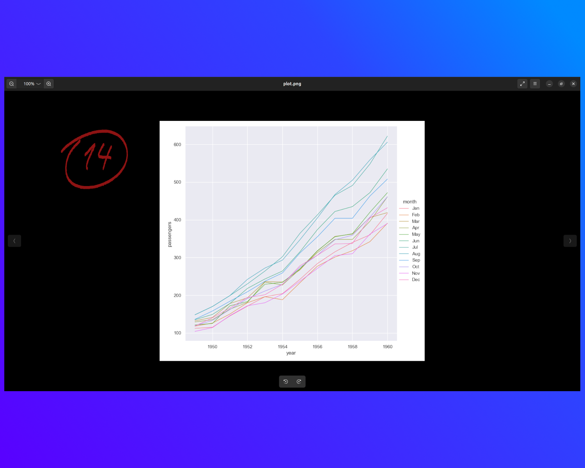
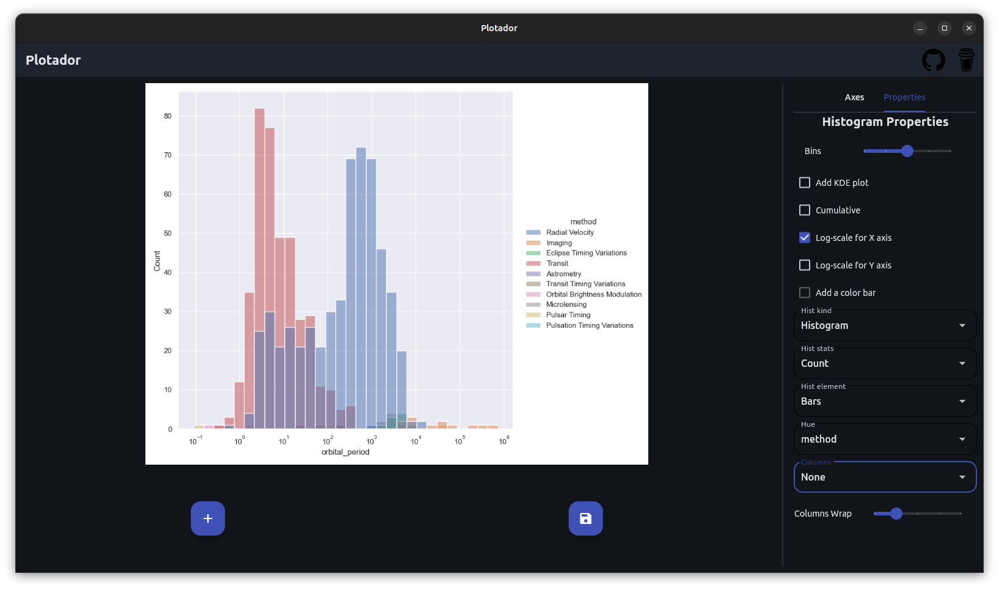

# Plotador

Plotador is a simple and easy-to-use plotting app built with Flet.  
It uses Seaborn to create and customize your graphs, all through a clean and intuitive interface.

No login, no subscription — everything runs locally!

## How to use

The first thing to do is to choose a file with your data. To do this, click the "plus" button at the botton left. 
A dialog will open allowing you to browse and choose your file. For this example, we'll be using a dataset from Seaborn called "flights".

Now we can select the plot type. Plotador supports three types: histogram, scatter and line. 
We'll select the line option on the right side of the interface.

After choosing the plot type, we need to select the information for each axis. 
Just below the plot type, we can find two dropdows — one for each axis (X and Y). 
We'll select "year" for the X-axis and "passengers" for the Y-axis.

A plot showing the number of passengers per year will appear in the center of the screen. 
Now we can further customize the plot by clicking the "Properties" tab at the top right.

Here, we can change the apperance of the plot and/or add more information to it. 
For example, let's say we want to know if the number of passengers varies depending on the mouth of the year. 
We can select the "month" option in the "Hue" dropdown. 
This option will draw a separate line for each month on the same plot.

Plotador automatically sets different colors for each month and adds a legend on the right side of the plot.

When you're happy with the plot, you can save it by clicking the save button. 
This will open a dialog so you can choose where to save the file and name the figure as you wish.

After confirming the save process, you can find the figure where you saved it. 
Plotador saves your plot as a .png image.

Now, explore other types of plots and available options!

## Plot types

Currently we suport three types of plots:

- Histogram;
- Line;
- Scatter;
- Categorical.

### Histogram

Both 1D and 2D histograms are supported. For 2D histograms the option "eCDF" for "Hist kind" is not available.

### Scatter

### Line

